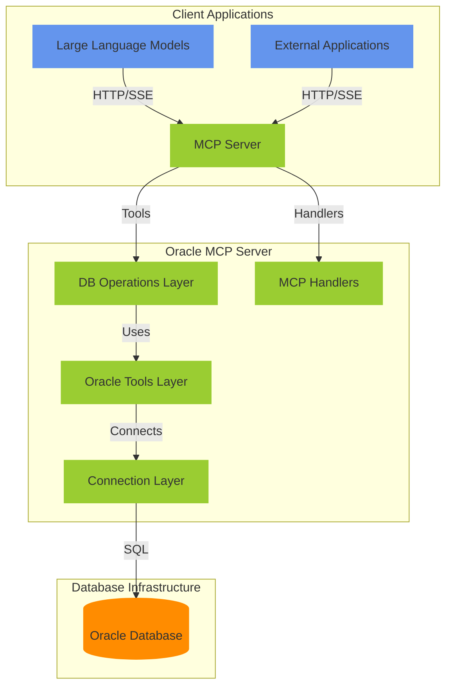
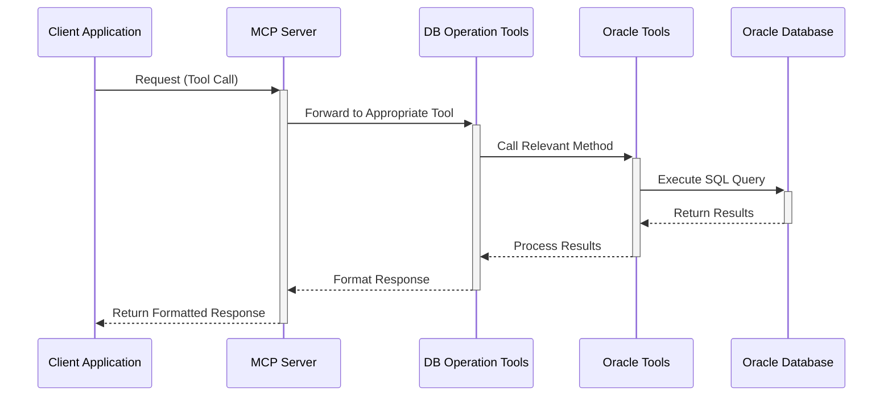

# Oracle MCP Server

**Author:** Rajkumar O
**Version:** 1.0.0


## Overview

The Oracle MCP (Model Context Protocol) Server is an enterprise-grade integration platform designed to provide a standardized interface for AI agents and external systems to interact with Oracle databases. It exposes database metadata, schema information, and query capabilities through a well-defined API, enabling seamless integration with modern AI-powered applications.

This server implements the Model Context Protocol (MCP) specification, offering a collection of tools for Oracle database exploration and interaction. It serves as a bridge between AI language models and enterprise Oracle database systems.

## Table of Contents

- [Architecture](#architecture)
  - [Component Overview](#component-overview)
  - [Architecture Diagram](#architecture-diagram)
  - [Flow Diagram](#flow-diagram)
- [Features](#features)
  - [Database Exploration](#database-exploration)
  - [Source Code Retrieval](#source-code-retrieval)
  - [Data Operations](#data-operations)
  - [Pagination and Resource Limiting](#pagination-and-resource-limiting)
- [Setup and Configuration](#setup-and-configuration)
  - [Prerequisites](#prerequisites)
  - [Environment Configuration](#environment-configuration)
  - [MCP Server Configuration](#mcp-server-configuration)
- [Usage](#usage)
  - [Available Tools](#available-tools)
  - [Example Queries](#example-queries)
- [Development](#development)
  - [Installation Guide](#installation-guide)
  - [Project Structure](#project-structure)
  - [Extending Functionality](#extending-functionality)
  - [Logging](#logging)
- [Deployment](#deployment)
  - [Production Considerations](#production-considerations)
  - [Security Best Practices](#security-best-practices)

## Architecture

### Component Overview

The Oracle MCP Server follows a modular, layered architecture adhering to Domain-Driven Design (DDD) principles and SOLID design patterns. The system is organized into the following key components:

1. **MCP Server Layer**: Handles API requests, authentication, and communication with clients
2. **Database Operation Tools**: Exposes database functionality as MCP tools
3. **DB Data Extractor Layer**: Provides abstracted database access functionality (handles direct Oracle DB interactions)
4. **Database Connection Layer**: Manages connection pooling and database interactions

### Architecture Diagram



### Flow Diagram

The following diagram illustrates the typical request flow through the system:



## Features

### Database Exploration

The Oracle MCP Server provides comprehensive database exploration capabilities:

- **Schema Discovery**: List available database schemas and users
- **Object Enumeration**: List tables, packages, procedures, functions, and other database objects
- **Object Details**: Retrieve detailed metadata about database objects
- **Dependency Analysis**: Analyze dependencies between database objects

### Source Code Retrieval

Retrieve and analyze source code from database objects:

- **Package Source**: View specifications and bodies of PL/SQL packages
- **Procedure/Function Source**: Examine standalone procedures and functions
- **Line-based Retrieval**: Request specific line ranges of source code

### Data Operations

Perform data operations on the Oracle database:

- **SQL Execution**: Run arbitrary SQL queries against the database
- **Table Exploration**: View table structures, columns, constraints, and indexes
- **Data Retrieval**: Query and format data from database tables

### Pagination and Resource Limiting

Control resource usage and handle large result sets:

- **Row Limiting**: Limit the number of rows returned from database queries
- **Line-based Pagination**: Retrieve specific line ranges for large source code files
- **Result Chunking**: Break large result sets into manageable chunks

## Setup and Configuration

### Prerequisites

- Python 3.10+
- Oracle database (11g or higher)
- Network access to target Oracle database
- Oracle client not required (oracledb Thin mode by default). Set `ORACLE_THICK_MODE=True` only if using the Oracle client.

### Environment Configuration

Create a `.env` file in the project root with the following variables:

```env
# Oracle Database Connection Settings
# Database connection credentials
ORACLE_USERNAME=SCOTT
ORACLE_PASSWORD=password
ORACLE_DSN=hostname:port/service_name

# Optional settings
ORACLE_ENCODING=UTF-8
ORACLE_THICK_MODE=False  # Set to True if using Oracle thick client

# MCP Server Configuration
MCP_PORT=8001
MCP_HOST=127.0.0.1

# Logging
LOG_DIRECTORY=logs
LOG_FILENAME=oracle_mcp.log
LOG_LEVEL=INFO
```

### MCP Server Configuration

The Oracle MCP Server can be run in several ways, and you can configure external MCP clients to connect to it. Here are the recommended ways to run the server:

#### Running the Server Directly

1. **As a module** (recommended):
  
   ```bash
   python -m oracle_mcp
   ```
  
   This method works when you're in the project root directory and doesn't require specifying the full path.
  
2. **Using an MCP inspector** (for debugging):

   ```bash
   npx @modelcontextprotocol/inspector python -m oracle_mcp
   ```

   This runs the server with the MCP inspector for debugging and testing.
  
3. **Using the main.py entry point**:

   ```bash
   python main.py
   ```

   This works when you're in the project root directory.

#### Configuring in MCP Config File

To configure external MCP clients to use this server, add the appropriate configuration to your MCP configuration file (typically `mcp_config.json`):

```json
{
  "mcpServers": {
    "oracle-mcp-server": {
      "command": "python",
      "args": ["-m", "oracle_mcp"],
      "env": {}
    }
  }
}
```

#### Configuration Parameters

- **command**: The command to run the server. Options include:
  - `"python"` for standard Python installations
  - `"npx"` if you're using the NPM inspector

- **args**: Command-line arguments based on your preferred method:
  
  For the module approach (recommended):

  ```json
  "args": ["-m", "oracle_mcp"]
  ```

  For the main.py approach:

  ```json
  "args": ["path/to/oracle-mcp-server/main.py"]
  ```

  For using with the MCP inspector:

  ```json
  "args": ["-y", "@modelcontextprotocol/inspector", "python", "-m", "oracle_mcp"]
  ```

- **env**: Environment variables for the server. You can specify Oracle connection details here if not using a .env file.

#### Additional Configuration Examples

**Using `uv` to run `main.py` with specific environment variables:**

This example demonstrates running the `main.py` script directly using `uv` (a fast Python project and virtual environment manager) and setting all necessary Oracle connection and MCP server parameters via environment variables.

```json
{
  "mcpServers": {
    "oracle-mcp-server": {
      "command": "uv",
      "args": [
        "--directory",
        "C:\\path\\to\\oracle-mcp-server",
        "run",
        "main.py"
      ],
      "env": {
        "ORACLE_USERNAME": "username",
        "ORACLE_PASSWORD": "password",
        "ORACLE_DSN": "host:port/service-id",
        "ORACLE_ENCODING": "UTF-8",
        "ORACLE_THICK_MODE": "False",
        "MCP_PORT": "8001",
        "MCP_HOST": "127.0.0.1",
        "ORACLE_AGENT_HOST": "127.0.0.1",
        "ORACLE_AGENT_PORT": "8002",
        "LOG_LEVEL": "INFO"
      },
      "disabled": false
    }
  }
}
```

**Using module approach with environment variables:**

```json
{
  "mcpServers": {
    "oracle-mcp-server": {
      "command": "python",
      "args": ["-m", "oracle_mcp"],
      "env": {
        "ORACLE_USERNAME": "username",
        "ORACLE_PASSWORD": "password",
        "ORACLE_DSN": "host:port/service-id",
        "ORACLE_ENCODING": "UTF-8",
        "ORACLE_THICK_MODE": "False",
        "MCP_PORT": "8001",
        "MCP_HOST": "127.0.0.1",
        "ORACLE_AGENT_HOST": "127.0.0.1",
        "ORACLE_AGENT_PORT": "8002",
        "ORACLE_TOOLS_LOG_LEVEL": "DEBUG"
      },
      "disabled": false
    }
  }
}
```

*Note: The `args` in this example use an absolute path. Adjust this path according to your local setup. The `ORACLE_PASSWORD` is mocked; replace `"password"` with your actual database password.*

## Usage

### Available Tools

The Oracle MCP Server exposes the following tools:

| Tool Name                              | Description                                                               | Key parameters                                        |
|----------------------------------------|---------------------------------------------------------------------------|-------------------------------------------------------|
| `list_schemas`                         | List available schemas/users.                                             | None                                                  |
| `list_tables`                          | List tables in a schema.                                                  | `schema`, `part_of_object_name`, `dynamicWhereClause`, `limit` |
| `list_packages`                        | List packages in a schema.                                                | `schema`, `part_of_object_name`, `dynamicWhereClause`, `limit` |
| `list_procedures`                      | List procedures in a schema.                                              | `schema`, `part_of_object_name`, `dynamicWhereClause`, `limit` |
| `list_functions`                       | List functions in a schema.                                               | `schema`, `part_of_object_name`, `dynamicWhereClause`, `limit` |
| `get_object_source_code`               | Get source or body for an object (PACKAGE/TYPE/PROCEDURE/FUNCTION/...).   | `schema`, `object_name`, `object_type`, `start_line_number`, `limit`, `dynamicWhereClause` |
| `get_table_basic_details`              | Oracle dictionary details for tables (supports partial matches).           | `schema`, `table_name`, `limit`                      |
| `get_table_details_with_column_and_indexes` | Full table columns, constraints, and indexes.                          | `schema`, `table_name`, `limit`, `dynamicWhereClause` |
| `get_table_columns`                    | Column details for a table.                                               | `schema`, `table_name`, `limit`, `dynamicWhereClause` |
| `get_table_constraints`                | Constraints for a table.                                                  | `schema`, `table_name`, `limit`                      |
| `get_table_indexes`                    | Indexes for a table.                                                      | `schema`, `table_name`, `limit`                      |
| `get_object_dependencies`              | Direct dependencies for an object.                                        | `owner`, `name`, `limit`, `dynamicWhereClause`       |
| `dependency_impact_analysis`           | Up/down dependency tree to given depth.                                   | `owner`, `name`, `depth`                             |
| `get_object_usage_audit`               | Object audit/usage metadata.                                              | `owner`, `name`                                      |
| `execute_sql`                          | Execute an arbitrary SQL query.                                           | `query`                                              |

### Example Queries

#### Exploring Database Schemas

**List all schemas:**
```python
result = await mcp_client.call_tool('list_schemas')
```

Expected result:
```json
{
  "schemas": ["SCOTT"],
  "count": 1
}
```

#### Working with Database Objects

**List tables in a schema with pagination:**
```python
result = await mcp_client.call_tool('list_tables', {
    'schema': 'SCOTT', 
    'limit': 10
})
```

Expected result:
```json
{
  "schema": "SCOTT",
  "tables": [
    {
      "owner": "SCOTT",
      "object_name": "ACE_FORM_DATA_TEMP",
      "object_type": "TABLE",
      "status": "VALID",
      "created": "2025-04-29T17:13:33",
      "last_modified": "2025-04-29T17:13:33"
    },
    ...
  ],
  "count": 10
}
```

**List packages in a schema with pagination:**
```python
result = await mcp_client.call_tool('list_packages', {
    'schema': 'SCOTT',
    'limit': 5
})
```

Expected result:
```json
{
  "schema": "SCOTT",
  "packages": [
    {
      "owner": "SCOTT",
      "object_name": "LOGGER",
      "object_type": "PACKAGE",
      "status": "VALID",
      "created": "2025-04-29T17:12:33",
      "last_modified": "2025-04-29T17:12:33"
    },
    ...
  ],
  "count": 5
}
```

**List procedures with pagination:**
```python
result = await mcp_client.call_tool('list_procedures', {
    'schema': 'SCOTT',
    'limit': 5
})
```

**List functions with pagination:**
```python
result = await mcp_client.call_tool('list_functions', {
    'schema': 'SCOTT',
    'limit': 5
})
```

#### Retrieving Source Code

**Get object source with line-based pagination (package):**
```python
result = await mcp_client.call_tool('get_object_source_code', {
    'schema': 'SCOTT',
    'object_name': 'LOGGER',
    'object_type': 'PACKAGE',
    'start_line_number': 100,
    'limit': 50
})
```

Expected result:
```json
{
  "schema_name": "SCOTT",
  "object_name": "LOGGER",
  "object_type": "PACKAGE",
  "source": "  PROCEDURE log_debug(p_text IN VARCHAR2);
  PROCEDURE log_info(p_text IN VARCHAR2);
  PROCEDURE log_warning(p_text IN VARCHAR2);
  PROCEDURE log_error(p_text IN VARCHAR2);
  ..."
}
```

**Get entire package source:**
```python
result = await mcp_client.call_tool('get_object_source_code', {
    'schema': 'SCOTT',
    'object_name': 'LOGGER',
    'object_type': 'PACKAGE'
})
```

#### Examining Table Structure

**Get table details (columns, constraints, indexes):**
```python
result = await mcp_client.call_tool('get_table_details_with_column_and_indexes', {
    'schema': 'SCOTT',
    'table_name': 'SI_DB_LOG'
})
```

Expected result:
```json
{
  "schema": "SCOTT",
  "table": "SI_DB_LOG",
  "columns": [
    {
      "column_name": "LOG_ID",
      "data_type": "NUMBER",
      "nullable": "N",
      "data_length": 22,
      "data_precision": 10,
      "data_scale": 0
    },
    {
      "column_name": "LOG_LEVEL",
      "data_type": "VARCHAR2",
      "nullable": "Y",
      "data_length": 1,
      "data_precision": null,
      "data_scale": null
    },
    ...
  ],
  "constraints": [...],
  "indexes": [...]
}
```

#### Executing SQL Queries

**Execute a simple SQL query:**
```python
result = await mcp_client.call_tool('execute_sql', {
    'query': "SELECT COUNT(*) FROM SI_DB_LOG WHERE LOG_LEVEL = 'E'"
})
```

Expected result:
```json
{
  "query": "SELECT COUNT(*) FROM SI_DB_LOG WHERE LOG_LEVEL = 'E'",
  "result": {
    "columns": ["COUNT(*)"],
    "rows": [[156]]
  }
}
```

**Execute a more complex query:**
```python
result = await mcp_client.call_tool('execute_sql', {
    'query': "SELECT LOG_LEVEL, COUNT(*) FROM SI_DB_LOG GROUP BY LOG_LEVEL ORDER BY LOG_LEVEL"
})
```

Expected result:
```json
{
  "query": "SELECT LOG_LEVEL, COUNT(*) FROM SI_DB_LOG GROUP BY LOG_LEVEL ORDER BY LOG_LEVEL",
  "result": {
    "columns": ["LOG_LEVEL", "COUNT(*)"],
    "rows": [
      ["C", 42],
      ["D", 1205],
      ["E", 156],
      ["I", 879],
      ["W", 327]
    ]
  }
}
```

## Detailed Tool Reference

This section provides detailed information about each tool available in the Oracle MCP Server.

### Schema Exploration Tools

#### `list_schemas`

**Purpose**: Retrieves a list of all schemas/users in the database that the user has access to.

**Parameters**: None

**Returns**: Dictionary with schemas list and count

**Notes**: Access is determined by the database user credentials used by the Oracle MCP Server.

#### `list_tables`

**Purpose**: Lists tables in the specified schema.

**Parameters**:

- `schema` (str): Schema name to list tables from
- `part_of_object_name` (str, optional): Partial match filter for object names
- `dynamicWhereClause` (str, optional): Additional WHERE clause conditions
- `limit` (int, optional): Maximum number of tables to return

**Returns**: Dictionary with schema name, tables list, and count

**Notes**: The tables are sorted by name and include metadata such as creation date and status.

#### `list_packages`

**Purpose**: Lists packages in the specified schema.

**Parameters**:

- `schema` (str): Schema name to list packages from
- `limit` (int, optional): Maximum number of packages to return

**Returns**: Dictionary with schema name, packages list, and count

**Notes**: The packages are sorted by name and include metadata such as creation date and status.

#### `list_procedures`

**Purpose**: Lists procedures in the specified schema.

**Parameters**:

- `schema` (str): Schema name to list procedures from
- `limit` (int, optional): Maximum number of procedures to return

**Returns**: Dictionary with schema name, procedures list, and count

#### `list_functions`

**Purpose**: Lists functions in the specified schema.

**Parameters**:

- `schema` (str): Schema name to list functions from
- `limit` (int, optional): Maximum number of functions to return

**Returns**: Dictionary with schema name, functions list, and count

#### `get_object_dependencies`

**Purpose**: Retrieves a list of database objects that a specified object depends on, or that depend on the specified object.

**Parameters**:

- `owner` (str): The schema/owner of the object.
- `name` (str): The name of the object.
- `limit` (int, optional): Maximum number of dependencies to return. If None, returns all dependencies.

**Returns**: A list of dictionaries, where each dictionary contains details about a dependent or dependency object (e.g., name, type, owner).

### Source Code Retrieval Tools

#### `get_object_source_code`

**Purpose**: Retrieves source code of a specific database object (PACKAGE/TYPE/PROCEDURE/FUNCTION/etc.). For PACKAGE/TYPE, both spec and body are available.

**Parameters**:
- `object_name` (str): Object name
- `object_type` (str): One of `PACKAGE`, `TYPE`, `PROCEDURE`, `FUNCTION`, `TRIGGER`, `JAVA SOURCE`
- `schema` (str): Owner/schema (default `SCOTT`)
- `start_line_number` (int, optional): Start line number
- `limit` (int, optional): Max lines to return
- `dynamicWhereClause` (str, optional): Extra filters for dictionary views

**Returns**: Object with `schema_name`, `object_name`, `object_type`, `source`, and optional `body` for PACKAGE/TYPE.

### Table Structure Tools

#### `get_table_details`

**Purpose**: Retrieves detailed information about a table's structure.

**Parameters**:

- `schema` (str): Schema name
- `table_name` (str): Table name

**Returns**: Dictionary with schema, table name, columns, constraints, and indexes

**Notes**: Provides comprehensive metadata about the table structure including column data types, precision, scale, and nullability.

### Data Query Tools

#### `execute_sql`

**Purpose**: Executes a SQL query against the database.

**Parameters**:

- `query` (str): SQL query to execute

**Returns**: Dictionary with the query and result (columns and rows)

**Notes**: Use with caution as this allows arbitrary SQL execution. Consider implementing query validation in production environments.

### Utility and Logging Tools

Refer to the Logging section for centralized logging configuration. Application-specific tools have been removed for general-purpose usage.

## Development

### Installation Guide

Follow these steps to set up the Oracle MCP Server for development:

1. **Clone the Repository:**

   ```bash
    git clone <repository_url>
    cd oracle-mcp-server
   ```

    *(Replace `<repository_url>` with the actual URL of your Git repository.)*

2. **Create and Activate a Virtual Environment:**
    It's highly recommended to use a virtual environment to manage project dependencies.

    ```bash
    # For Windows
    python -m venv venv
    .\venv\Scripts\activate

    # For macOS/Linux
    python3 -m venv venv
    source venv/bin/activate
    ```

3. **Install Dependencies:**
    Recommended: use `uv` for a fast, reproducible install with `uv.lock`.

    ```bash
    # Using uv (preferred)
    uv sync --frozen

    # Fallback: pip + venv
    python -m venv .venv
    .\.venv\Scripts\activate
    pip install -r requirements.txt
    ```

4. **Configure Environment Variables:**
    The server requires environment variables for configuration, primarily for database connection details.
    - Copy the example environment file:

        ```bash
        cp .env.example .env
        ```

    - Edit the `.env` file and provide the necessary values for your Oracle database connection (e.g., `DB_USER`, `DB_PASSWORD`, `DB_HOST`, `DB_PORT`, `DB_SERVICE_NAME`). Refer to the comments in `.env.example` for guidance on each variable.

5. **Verify Setup:**
    Once the above steps are completed, you should be able to run the server. Refer to the [MCP Server Configuration](#mcp-server-configuration) section for instructions on how to run the server.

### Project Structure

```text
oracle-mcp-server/
├── main.py                        # Entry point
├── oracle_mcp/                   # MCP server implementation
│   ├── __main__.py                # Module entry runner (python -m oracle_mcp)
│   ├── config.py                  # Central configuration (env-backed)
│   ├── utils/
│   │   └── logger.py              # Common logging utility (centralized)
│   └── tools/
│       ├── db_operations.py       # Database operation tools
│       ├── handlers.py            # MCP handlers
│       └── server.py              # Server configuration
├── db_data_extractor/            # Oracle database access layer
│   ├── README.md                  # Details for this module
│   ├── standard/                  # Standard database interaction components
│   │   ├── connection.py          # Database connection management
│   │   ├── schema.py              # Schema exploration tools
│   │   ├── table.py               # Table operations
│   │   ├── source.py              # Source code retrieval
│   │   ├── data.py                # Data operations
│   │   ├── dataobject.py          # Data object utilities
│   │   ├── documentation.py       # Documentation extraction utilities
│   │   ├── change_tracking.py     # Change tracking utilities
│   │   ├── diagnostics.py         # Diagnostic utilities
│   │   └── db_models/             # Standard Pydantic models for DB
│   └── utils/                     # Utility functions
│       ├── log_utils.py           # Logging helpers (decorators)
│       ├── db_utils.py            # Database utilities
│       ├── json_utils.py          # JSON sanitization utilities
│       ├── general_functions.py   # General utility functions
│       └── validation.py          # SQL validation and error handling
├── logs/                          # Log files directory
├── .env                           # Environment configuration
├── .env.example                   # Example environment configuration
├── requirements.txt               # Python dependencies (pip fallback)
├── uv.lock                        # Locked dependency versions (uv)
├── ReadMe.md                      # Main project README (this file)
└── DeveloperReadMe.md             # README for developers
```

### Extending Functionality

To add new database operation tools:

1. Create or modify appropriate functions in the Oracle Tools layer
2. Register new tools in `oracle_mcp/tools/db_operations.py`
3. Document the new tools in the API documentation

### Logging

- Centralized logger utility: `oracle_mcp/utils/logger.py`
- Configure once in `main.py` using `setup_logging(enable_console=False)` and get a logger via `get_logger()`.
- Logs written to `logs/<LOG_FILENAME>` (default `oracle_mcp.log`).
- Control via env: `LOG_DIRECTORY`, `LOG_FILENAME`, `LOG_LEVEL`. Set `LOG_LEVEL=DEBUG` for verbose logs.

## Deployment

### Production Considerations

- **Connection Pooling**: For high-traffic environments, configure appropriate connection pool sizes
- **Resource Limits**: Set appropriate limits on query results and execution time
- **Load Balancing**: For high-availability deployments, consider running multiple instances behind a load balancer

### Security Best Practices

- **Database Credentials**: Use a dedicated read-only account for the MCP server
- **Network Security**: Restrict network access to the database and MCP server
- **Query Validation**: Implement SQL injection protection and query validation
- **Authentication**: Add authentication for the MCP server in production environments
